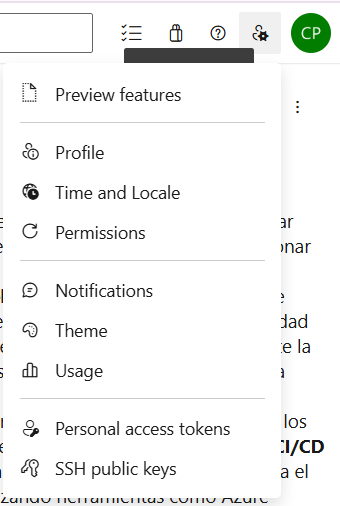

# Proyecto laboratorio de LangChain - MCP - Azure Devops
En este proyecto se explora la integración de LangChain con Azure DevOps a través del Azure DevOps MCP Server. 

Su objetivo principal es construir un chatbot conversacional que permite a los usuarios consultar la Wiki de un proyecto de Azure DevOps utilizando lenguaje natural, facilitando el acceso a la información y la interacción con las capacidades de la plataforma.

## Configuración del Entorno de Desarrollo
### Requisitos previos:
- Node.js y npm: Necesarios para instalar el Azure DevOps MCP Server.
- Python 3.9+: La versión recomendada para el desarrollo de esta aplicación.


### 1. **Entorno Virtual de Python**
Es una buena práctica crear un entorno virtual para gestionar las dependencias del proyecto de forma aislada.

1. Crear entorno virtual:
```bash 
python -m venv .venv
```
2. Activar entorno virtual:
```bash 
.venv\Scripts\Activate.ps1
```
3. Instalar dependencias:
```bash 
pip install -r requirements.txt
```

### 2. **Configuración del Azure DevOps MCP Server**
El Agente requiere del MCP Server para comunicarse con Azure DevOps.

1. Instalar el MCP Server globalmente:

```bash 
npm install -g @azure-devops/mcp
```

Fuente https://github.com/microsoft/azure-devops-mcp


### 3. Configuración de Variables de Entorno (.env)
1. Crear el archivo .env:
2. Copia el archivo env-example y renómbralo a .env:

```bash 
copy .env-example .env
```

3. Completar el archivo .env:
- GOOGLE_API_KEY: Buscar en https://aistudio.google.com
- AZDO_ORG_URL: "https://dev.azure.com/TU_ORGANIZACION" Reemplazar 
- AZDO_DEFAULT_PROJECT: Nombre de tu proyecto principal de Azure DevOps
- AZDO_PAT (Personal Access Token): Para generarlo en Azure DevOps hace clic en el icono de "User settings" y "Personal access tokens"


### 4. Configuracion de variables de MCP
1. Acceder a utils/mcp.py y modificar:
AZURE_DEVOPS_ORG_NAME = "camilabperez" 
NODE_PATH = "C:/Program Files/nodejs/node.exe"
MCP_SERVER_INDEX_JS_PATH = "C:/Users/Socius/AppData/Roaming/npm/node_modules/@azure-devops/mcp/dist/index.js" 

En realidad son rutas que tendria que encontrar automaticamente y no deberia definir, pero no fue mi caso. Se debe mejorar


### 5. Ejecución de las Aplicaciones
El proyecto contiene diferentes scripts, algunos con interfaz de usuario y otros de línea de comandos.

1. Ejecutar Aplicaciones Streamlit (Con Interfaz Web)
Para lanzar la interfaz gráfica del ChatBot:

```bash 
streamlit run main-app.py
```

Esto abrirá la aplicación en tu navegador web.

2. Ejecutar Scripts de Línea de Comandos 

```bash 
py labs/hello_world.py
```
Ajusta la ruta y el nombre del archivo según el script que quieras ejecutar

## Estructura del Proyecto 
Una breve descripción de la estructura principal de tu proyecto puede ser muy útil para nuevos colaboradores:

- docs: por el momento solo imagenes del README
- labs: proyectitos que pueden andar o no que realice leyendo documentacion y mirando videos
- tools: contiene herramientas que son definidas manualmente para ser utilizadas por el agente de llm
- utils
    - mcp.py: define la logica para usar el cliente que interactúa con el servidor Azure DevOps MCP, permitiendo que la app interactue con Azure DevOps a través de comunicación por línea de comandos (stdin/stdout). 
    - streamlitToolCallbackHandler.py: define metodos para mostrar las herramientas que estan siendo usadas por el llm
- main-app.py: aplicacion principal, en la que se esta desarrollando el chatbot


